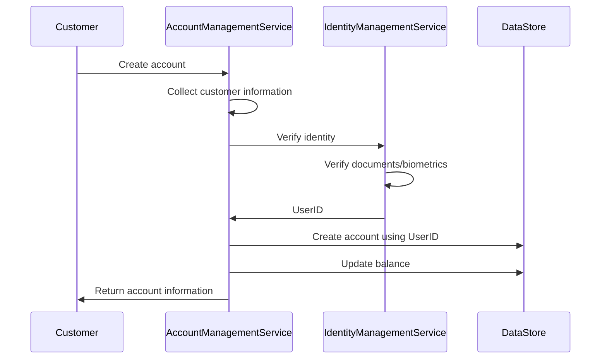
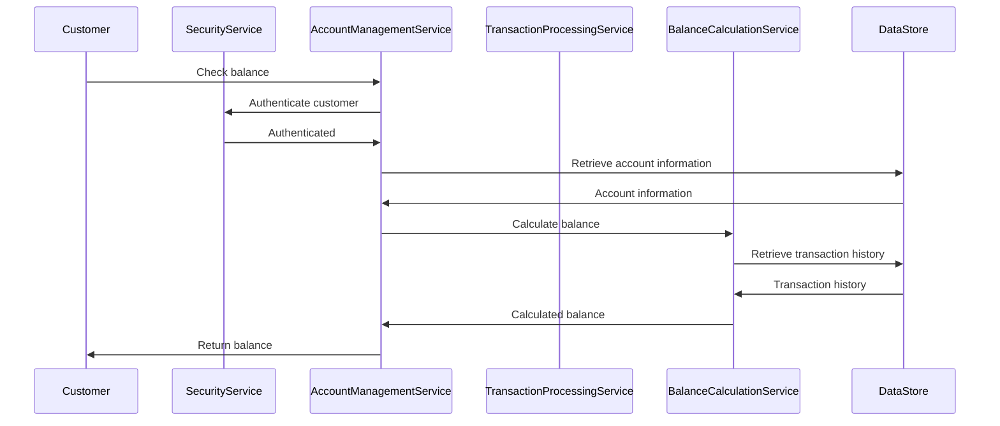
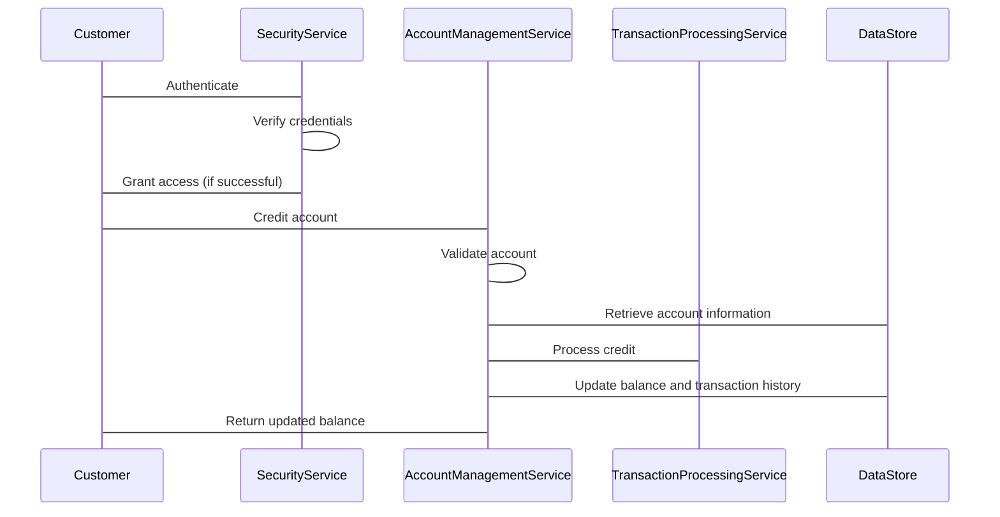

Account Creating


Account balance check


Account crediting




Account tranfer

```mermaid
sequenceDiagram
    participant Customer
    participant AuthenticationService
    participant AccountManagementService
    participant TransactionProcessingService
    participant DataStore

    Customer->AuthenticationService: Authenticate
    AuthenticationService->AuthenticationService: Verify credentials
    AuthenticationService->Customer: Grant access (if successful)
    Customer->AccountManagementService: Transfer funds
    AccountManagementService->AccountManagementService: Validate accounts
    TransactionProcessingService->AccountManagementService: Verify funds
    TransactionProcessingService->AccountManagementService: Debit source account
    TransactionProcessingService->AccountManagementService: Credit destination account
    DataStore->AccountManagementService: Update balances and transaction history
    AccountManagementService->Customer: Return transaction result